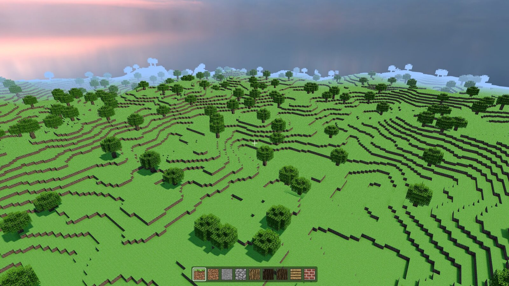

<p align="center"></p>
<h1 align="center">SleakEngine</h1>
<p align="center">A C++23 game engine with four graphics backends: Vulkan, OpenGL, DirectX 11, and DirectX 12.</p>

<p align="center">
  <a href="https://github.com/CanReader/SleakEngine/actions/workflows/ci.yml"></a>
  <a href="https://canreader.github.io/SleakEngine/"></a>
  
  
  
</p>

SleakEngine is a game engine library you link into your own project. You write a game
class, register scenes, populate them with GameObjects and components, and the engine
runs the window, render loop, lighting, physics, culling, and input. The engine has no
game vocabulary of its own: it ships general mechanisms, including a custom vertex
format API that lets a game register its own mesh layouts and shaders at runtime.

<p align="center"></p>
<p align="center"><i>SleakCraft, a voxel sandbox built on SleakEngine's Vulkan backend.</i></p>

## Features

**Rendering**
- Four backends behind one renderer interface: Vulkan, OpenGL, DirectX 11, DirectX 12,
  selectable at launch with `-r vulkan|opengl|d3d11|d3d12`
- Deferred shading with a GBuffer pipeline, plus a forward path for transparents
- Physically based shading (Cook-Torrance GGX), normal mapping, emissive, cutout and
  transparent material modes
- Shadow mapping with PCF and PCSS filtering, HDR pipeline with ACES tone mapping,
  SSAO, SSR, TAA, bloom, MSAA, image based lighting, distance and height fog
- Custom vertex formats: register a `Sleak::VertexLayoutDesc` with up to four shader
  stems and the engine builds and binds the matching pipelines per pass
- The full status of every graphics feature is tracked on the
  [Graphics Features](https://canreader.github.io/SleakEngine/graphics_features.html) page

**Engine systems**
- Scene and GameObject model with components, `Sleak::RefPtr` resource ownership,
  and explicit scene lifecycle hooks
- Physics with rigid bodies, colliders, and a dynamic AABB tree broadphase
- CPU frustum culling plus adaptive software occlusion culling
- Synchronous event system for input, window, and application events
- Skeletal animation with GPU skinning (up to 256 bones)
- Assimp-backed model loading, texture management, UI layer, logging, benchmark metrics

## Documentation

The full manual and C++ API reference is published at
**[canreader.github.io/SleakEngine](https://canreader.github.io/SleakEngine/)**:

- **Getting Started** takes you from an empty directory to a running window with a
  lit, textured object you can fly around, then a small playable game.
- **Programming Guide** covers every subsystem: the rendering pipeline, lighting,
  shader authoring, vertex formats, scenes, events, physics, culling, assets,
  animation, UI, and debug tools, with architecture diagrams throughout.
- **Optimization and Support** holds the performance guide, the per-backend feature
  matrix, and a troubleshooting page.

To build the docs locally, install Doxygen and Graphviz and run `doxygen Doxyfile`
in the repo root, then open `docs/html/index.html`.

## Building

```bash
cmake -B build -S .
cmake --build build -j
```

Requires a C++23 compiler and CMake. Vulkan and OpenGL backends build everywhere;
DirectX 11/12 build on Windows. Third-party dependencies live in `vendors/` as
submodules, so clone with `--recurse-submodules`.

## Quick start

The smallest SleakEngine program is an entry point plus a game class. The entry point
parses the command line, then hands your game to the application loop:

```cpp
#include <Core/Application.hpp>
#include <Core/CommandLine.hpp>
#include <Core/Logger.hpp>
#include "Game.hpp"

int main(int argc, char** argv) {
    Sleak::CommandLine::Parse(argc, argv);
    Sleak::Logger::Init("MyGame");

    Sleak::ApplicationDefaults defaults{
        .Name = "MyGame",
        .CommandLineArgs = Sleak::Arguments(argc, argv)};

    Sleak::Application app(defaults);
    return app.Run(new Game());
}
```

The game class owns your scenes:

```cpp
#include <Core/GameBase.hpp>
#include <Core/OSDef.hpp>

class SLEAK_API Game : public Sleak::GameBase {
public:
    bool Initialize() override;          // register scenes here
    void Begin() override;               // activate the first scene
    void Loop(float deltaTime) override; // per-frame game logic

    bool GetIsGameRunning() override { return bIsGameRunning; }

private:
    bool bIsGameRunning = true;
};
```

From there, scenes derive from `Sleak::Scene` and spawn GameObjects with mesh,
material, camera, light, and physics components. The
[Getting Started guide](https://canreader.github.io/SleakEngine/getting_started.html)
walks through the whole thing, including CMake setup and asset staging.

## Repository layout

```
include/public/   Public API: the only headers a game may include
include/private/  Internal headers, free to change between versions
src/              Implementation, one folder per subsystem
  Core/  Math/  Scene/  Animation/  Physics/  Lighting/  Culling/
  Assets/  Debug/  UI/  Graphics/{Common, Vulkan, OpenGL, DirectX11, DirectX12}
assets/           Engine shaders and built-in assets, staged next to your binary
vendors/          Third-party libraries (SDL3, Assimp, glm, fmt, ImGui, ...)
docs/             Doxygen manual sources
```

## Games built on SleakEngine

- **SleakCraft**: a voxel sandbox with streamed chunks, its own 48-byte vertex
  format, and a full save system
- **SleakSims**: a character and animation showcase
- **SleakEngine-FPP**: a first person template
- **SleakEngine-Empty**: the starter template the Getting Started guide is built
  from; fork it to begin your own game

## License

MIT. See [LICENSE](LICENSE).
